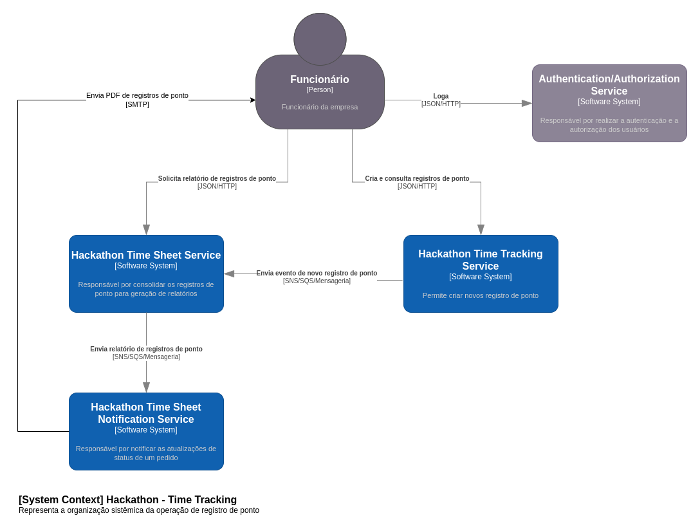
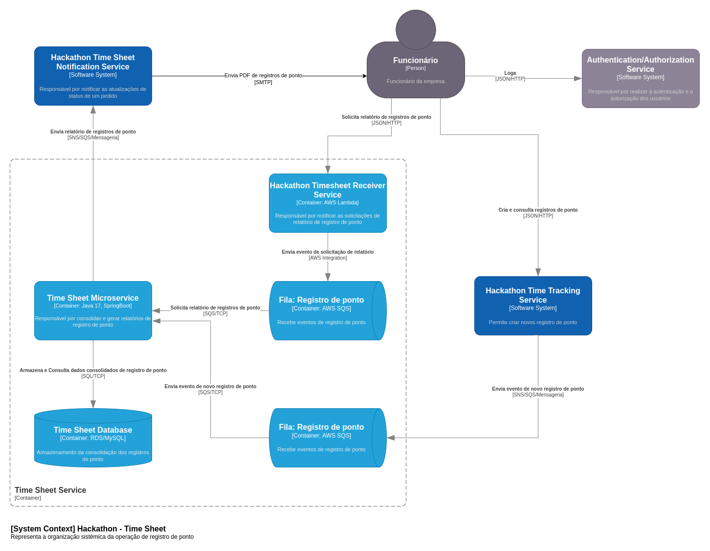

# Hackathon Time Sheet Microservice

## Problema
A Hackaton Company SA, uma empresa de grande porte com mais de 100.000 colaboradores e que atende diversas áreas, inclusive tecnologia, está em um ponto de transição crucial. Atualmente, está utilizando um sistema de ponto eletrônico terceirizado, mas devido a questões de qualidade e custos mensais significativos por usuário, a diretoria decidiu por construir o próprio sistema de ponto eletrônico interno. E, para que atenda as diversas filiais e pontos de trabalho dos colaboradores, este novo sistema será baseado em nuvem.

A decisão de migrar para um sistema interno e em nuvem é motivada por várias razões. A primeira é relacionada à qualidade do serviço fornecido pelo sistema terceirizado, que tem sido insatisfatória, com problemas frequentes de desempenho e disponibilidade. Somando-se a isso, os custos mensais por usuário estão se tornando proibitivos, especialmente considerando a quantidade de colaboradores. E outro ponto importante é a possibilidade de controlar a evolução do software implementando as melhorias necessárias sempre que desejado.

Ao construir o próprio sistema em nuvem, espera-se não apenas economizar custos no longo prazo, mas também melhorar a qualidade e a confiabilidade do registro de ponto para os colaboradores. A nuvem oferece benefícios significativos em termos de escalabilidade, disponibilidade e segurança, tornando-a a escolha ideal para o novo sistema.

Este projeto envolverá a criação de um sistema de ponto eletrônico robusto, escalável e seguro que possa suportar a carga de nossa grande força de trabalho. O novo sistema irá implementar as funcionalidades do sistema atual, e terá uma série de recursos adaptados à realidade da nossa empresa, incluindo a autenticação de usuário, registro de ponto, visualização e edição de registros, geração de relatórios, notificações e integração com outros sistemas.

A transição para a nuvem é um passo importante para o início de grandes modernizações dentro da organização.

## Solução

Foi elaborado um conjunto de serviços para viabilizar a operação de registro de ponto!



Nesse repositório, temos a implementação do serviço de registro de ponto (Hackathon Time Sheet Microservice).  



## Repositórios de IaC

### Repositórios Infra AWS Cloud

Nossa infraestrutura de Cloud está dividida da seguinte forma:

1) [hackathon-infra-foundation](https://github.com/fiap-postech/hackathon-infra-foundation): Repositório com a infra-estrutura responsável por toda a fundação, que inclui camada de rede (VPC), Security Groups, Subnets, Internet Gateway, API Gateway e etc.
2) [hackathon-iac-microservice-foundation](hackathon-iac-microservice-foundation): Repositório com a infra-estrutura base para micro serviços: AWS ECS Cluster, API Gateway, VPC Link.

### Repositório Infra Time Sheet Microservice

1) [hackathon-iac-timesheet-microservice](https://github.com/fiap-postech/hackathon-iac-timesheet-microservice): Repositório que contem o código de aprovisionamento dos recursos para o workload do Time Sheet microservice.

## Estrutura Geral do Projeto
```
./hackathon-timesheet-microservice
├── README.md
├── adapter
│   └── src
│       ├── main
│       │   └── java
│       │       └── br
│       │           └── com
│       │               └── fiap
│       │                   └── tech
│       │                       └── challenge
│       │                           └── adapter
│       │                               ├── controller
│       │                               │   └── customer
│       │                               ├── dto
│       │                               ├── gateway
│       │                               │   └── customer
│       │                               ├── mapping
│       │                               ├── presenter
│       │                               └── repository
│       └── test
│           └── java
│               └── br
│                   └── com
│                       └── fiap
│                           └── tech
│                               └── challenge
│                                   └── adapter
│                                       ├── controller
│                                       ├── fixture
│                                       ├── gateway
│                                       └── presenter
├── application
│   └── src
│       ├── main
│       │   └── java
│       │       └── br
│       │           └── com
│       │               └── fiap
│       │                   └── tech
│       │                       └── challenge
│       │                           └── application
│       │                               ├── dto
│       │                               ├── gateway
│       │                               └── usecase
│       │                                   └── customer
│       └── test
│           └── java
│               └── br
│                   └── com
│                       └── fiap
│                           └── tech
│                               └── challenge
│                                   └── application
│                                       ├── fixture
│                                       └── usecase
│                                           └── customer
├── doc
├── drivers
│   ├── customer-remove-data-producer
│   │   └── src
│   │       └── main
│   │           └── java
│   │               └── br
│   │                   └── com
│   │                       └── fiap
│   │                           └── tech
│   │                               └── challenge
│   │                                   └── customer
│   │                                       └── driven
│   │                                           └── customer
│   │                                               └── producer
│   │                                                   ├── config
│   │                                                   ├── dto
│   │                                                   └── messaging
│   ├── mysql
│   │   └── src
│   │       ├── main
│   │       │   ├── java
│   │       │   │   └── br
│   │       │   │       └── com
│   │       │   │           └── fiap
│   │       │   │               └── tech
│   │       │   │                   └── challenge
│   │       │   │                       └── driven
│   │       │   │                           └── mysql
│   │       │   │                               ├── config
│   │       │   │                               ├── mapping
│   │       │   │                               ├── model
│   │       │   │                               ├── repository
│   │       │   │                               └── service
│   │       │   └── resources
│   │       │       └── db
│   │       │           ├── migration
│   │       │           └── test
│   │       └── test
│   │           └── java
│   │               └── br
│   │                   └── com
│   │                       └── fiap
│   │                           └── tech
│   │                               └── challenge
│   │                                   └── driven
│   │                                       └── mysql
│   │                                           └── fixture
│   ├── rest
│   │   └── src
│   │       ├── main
│   │       │   └── java
│   │       │       └── br
│   │       │           └── com
│   │       │               └── fiap
│   │       │                   └── tech
│   │       │                       └── challenge
│   │       │                           └── rest
│   │       │                               ├── config
│   │       │                               ├── mapping
│   │       │                               └── resource
│   │       │                                   ├── doc
│   │       │                                   ├── request
│   │       │                                   └── response
│   │       └── test
│   │           └── java
│   │               └── br
│   │                   └── com
│   │                       └── fiap
│   │                           └── tech
│   │                               └── challenge
│   │                                   ├── fixture
│   │                                   ├── rest
│   │                                   └── util
│   ├── timesheet-report-s3
│   │   └── src
│   │       └── main
│   │           └── java
│   │               └── br
│   │                   └── com
│   │                       └── fiap
│   │                           └── tech
│   │                               └── challenge
│   │                                   └── customer
│   │                                       └── driven
│   │                                           └── customer
│   │                                               └── inquiry
│   │                                                   └── producer
│   │                                                       ├── config
│   │                                                       ├── dto
│   │                                                       └── repository
│   ├── timesheet-request-consumer
│   │   └── src
│   │       └── main
│   │           └── java
│   │               └── br
│   │                   └── com
│   │                       └── fiap
│   │                           └── tech
│   │                               └── challenge
│   │                                   └── customer
│   │                                       └── driven
│   │                                           └── customer
│   │                                               └── data
│   │                                                   └── removal
│   │                                                       └── response
│   │                                                           └── consumer
│   │                                                               ├── config
│   │                                                               ├── mapping
│   │                                                               └── messaging
│   └── timetracking-consumer
│       └── src
│           └── main
│               └── java
│                   └── br
│                       └── com
│                           └── fiap
│                               └── tech
│                                   └── challenge
│                                       └── customer
│                                           └── driven
│                                               └── customer
│                                                   └── data
│                                                       └── removal
│                                                           └── action
│                                                               └── consumer
│                                                                   ├── config
│                                                                   └── messaging
├── enterprise
│   └── src
│       └── main
│           └── java
│               └── br
│                   └── com
│                       └── fiap
│                           └── tech
│                               └── challenge
│                                   └── enterprise
│                                       ├── entity
│                                       ├── enums
│                                       ├── error
│                                       └── valueobject
├── gradle
│   └── wrapper
├── infra
│   └── docker
│       └── mysql
│           └── script
├── launcher
│   └── src
│       ├── main
│       │   ├── java
│       │   │   └── br
│       │   │       └── com
│       │   │           └── fiap
│       │   │               └── tech
│       │   │                   └── challenge
│       │   │                       └── launcher
│       │   │                           └── configuration
│       │   └── resources
│       └── test
│           ├── java
│           │   └── br
│           │       └── com
│           │           └── fiap
│           │               └── tech
│           │                   └── challenge
│           │                       └── launcher
│           │                           ├── config
│           │                           ├── container
│           │                           ├── fixture
│           │                           ├── rest
│           │                           └── util
│           └── resources
│               └── schemas
└── tests
    └── fixture
```

## Como executar o projeto?

### Pré-Requisitos ⚙️

<br>
<br>


### Preparação 💻

Independente da forma que escolha para executar o projeto, temos o seguinte procedimento a ser executado:

1. Clone o projeto desse repositório do Github
```sh
git clone https://github.com/fiap-postech/hackathon-timesheet-microservice.git
```
2. Acesse a pasta do projeto pelo terminal/cmd
```sh
cd hackathon-timesheet-microservice
```
3. Execute o comando de build do projeto
```sh
./gradlew build
```

### Execução 🏃

1. Execute o docker-compose.yml para iniciar o provisionamento da infra local
```sh
docker-compose -f infra/docker-compose-local.yml up -d
```
2. Com isso, você já pode executar o projeto pela IDE de sua preferência ou, se preferir, pode executar o projeto pela
   linha de comando com:
```sh
./gradlew bootRun
```
Ao executar o serviço, o servidor responderá no endereço: `http://localhost:8689`. Ao acessar essa url você será redirecionado ao swagger do projeto.
